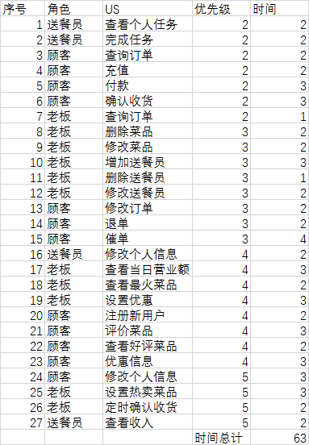

# 软件工程
##User Story
> 我是一个餐厅的**老板**，我要一个软件，能帮助我完成桌面点餐的功能。
> - 最急需的功能就是顾客可以在座位上选择自己想要的菜品，通过下单传到厨房。
> - 可以查询修订菜单的菜品
> - 合理的把订单分配给送餐员
> ***
> 我是餐厅的**送餐员**
> - 我要登陆
> - 我要查看我的任务
> - 我要看我的收入
> ***
> 我是餐厅的**顾客**
> - 查看菜单
> - 优惠
> - 我能查看订单
> - 评价
> - 退单
> - 催单
> - 我可以下单
> - 可以修改订单
> - 可以充值
> - 可以付款
> - 给我推荐热卖菜品

## product backlog
> 老板	上传新菜品		1	9
老板	查询菜品		1	3
老板	为送餐员分配订单		1	9
顾客	查看菜单		1	3
顾客	菜品加入购物车		1	3
顾客	查看菜品详细信息		1	3
顾客	下单		1	9
老板	查看送餐员		1	6
顾客	登陆		1	6
送餐员	查看个人任务		2	6
送餐员	完成任务		2	6
顾客	查询订单		2	6
顾客	充值		2	6
顾客	付款		2	9
顾客	修改信息		2	9
顾客	确认收货		2	9
老板	删除菜品		3	6
老板	修改菜品		3	6
老板	增加送餐员		3	9
老板	删除送餐员		3	3
老板	修改送餐员		3	6
顾客	修改订单		3	6
顾客	退单		3	6
顾客	催单		3	12
老板	查询订单		4	3
送餐员	修改个人信息		4	6
老板	查看当日营业额		4	9
老板	查看最火菜品		4	6
老板	设置优惠		4	9
顾客	注册新用户		4	6
顾客	评价菜品		4	9
顾客	当日特卖		4	6
顾客	优惠信息		4	9
老板	设置热卖菜品		5	9
老板	定时确认收货		5	6
送餐员	查看收入		5	6

> 时间 240H

##Sprint
###1. sprint
> 老板	上传新菜品		1	9
老板	查询菜品		1	3
老板	为送餐员分配订单		1	9
顾客	查看菜单		1	3
顾客	菜品加入购物车		1	3
顾客	查看菜品详细信息		1	3
顾客	下单		1	9
老板	查看送餐员		1	6
顾客	登陆		1	6

**任务分配**
唐昭 123
曹晓欢 456
李俊 789

***
### 2.Sprint
**人员分工**
> - Product owner 李俊
> - matser 卞汛
> - 搬砖 曹晓欢 李俊

**product backlog 修改**
> - 顾客	修改个人信息  优先级降为5
> - 老板	查询订单 优先级升 2
> - 顾客	当日特卖 删除
> - 顾客	查看好评菜品 添加
> - 老板	设置热卖菜品 之前不明确。更正为查看最火菜品

**新的 sprint**
> 
序号	角色	US	优先级	时间
1	送餐员	查看个人任务	2	2
2	送餐员	完成任务	2	2
3	顾客	查询订单	2	2
4	顾客	充值	2	2
5	顾客	付款	2	3
6	顾客	确认收货	2	3
7	老板	查询订单	2	1
8	老板	删除菜品	3	2
9	老板	修改菜品	3	2
10	老板	增加送餐员	3	3
11	老板	删除送餐员	3	1
12	老板	修改送餐员	3	2
13	顾客	修改订单	3	2
14	顾客	退单	3	2
15	顾客	催单	3	4
16	送餐员	修改个人信息	4	2
17	老板	查看当日营业额	4	3
18	老板	查看最火菜品	4	2
19	老板	设置优惠	4	3
20	顾客	注册新用户	4	2
21	顾客	评价菜品	4	3
22	顾客	查看好评菜品	4	2
23	顾客	优惠信息	4	3
24	顾客	修改个人信息	5	3
25	老板	设置热卖菜品	5	3
26	老板	定时确认收货	5	2
27	送餐员	查看收入	5	2
			时间总计	63

**sprint backlog**
> 序号	角色	US	优先级	时间
1	送餐员	查看个人任务	2	2
2	送餐员	完成任务	2	2
3	顾客	查询订单	2	2
4	顾客	充值	2	2
5	顾客	付款	2	3
6	顾客	确认收货	2	3
7	老板	查询订单	2	1
8	老板	删除菜品	3	2
9	老板	修改菜品	3	2

**任务分配**

唐昭 123
曹晓欢 456
卞汛 789
***
**设计文档（sprint 2）**
//交互图

流程图

类图

函数调用图

**测试 （sprint 2）**
模块微测试

集成测试

人工功能测试

**燃尽图**

